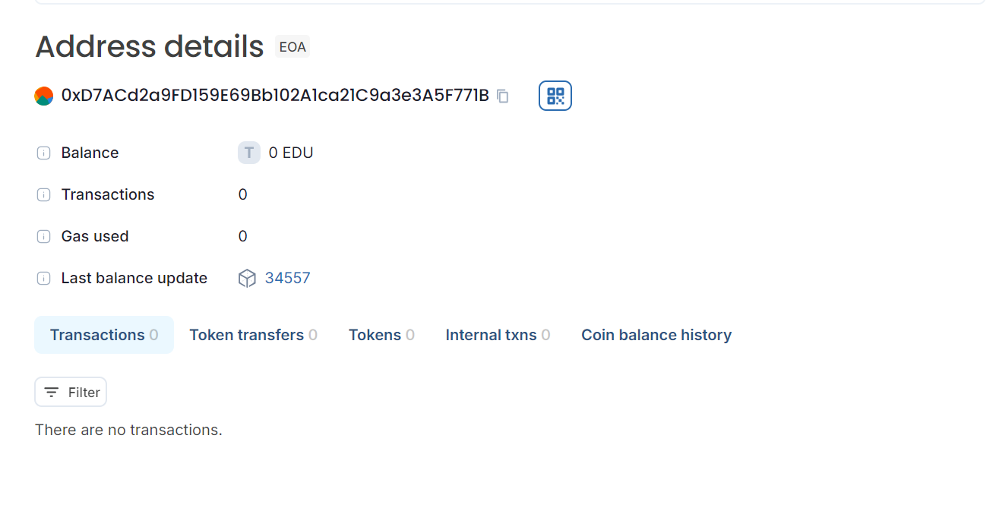

# AlumniNetworkDAO Smart Contract

## Vision

The **AlumniNetworkDAO** aims to create a decentralized platform where alumni can propose, vote on, and execute initiatives that benefit their network. The contract empowers members to drive positive change within the alumni community, streamline decision-making processes, and track the progress of various initiatives through a transparent and automated system.

## Project Features

- **Propose Initiatives:** Members can propose new initiatives to improve or engage the alumni network.
- **Vote on Initiatives:** Members can vote on proposed initiatives to express their support or opposition.
- **Execute Initiatives:** Initiatives with sufficient votes can be executed, indicating the community's endorsement.
- **View Initiative Details:** Members can view details of any initiative, including its title, description, vote count, and execution status.

## Future Scope

- **Multi-Signature Voting:** Implement a multi-signature requirement for executing initiatives to enhance security.
- **Quorum Requirement:** Introduce a quorum requirement to ensure a minimum number of votes are cast before an initiative can be executed.
- **Governance Tokens:** Integrate a token-based voting system to allocate voting power based on token holdings.
- **Enhanced Reporting:** Develop additional features to generate reports and statistics on initiatives and voting patterns.
- **Integration with Web3 Applications:** Create a frontend interface to interact with the smart contract via Web3 technologies for better user experience.

## Project Structure

The project consists of the following components:

1. **Smart Contract Code:**
   - **`AlumniNetworkDAO.sol`:** The main Solidity contract implementing the DAO functionality.

2. **Contract Features:**
   - **Structs:**
     - `Initiative`: Represents an initiative with details such as ID, title, description, vote count, and execution status.
   - **State Variables:**
     - `nextInitiativeId`: Tracks the ID of the next initiative to be proposed.
     - `initiatives`: A mapping from initiative IDs to their corresponding `Initiative` struct.
   - **Events:**
     - `InitiativeProposed`: Emitted when a new initiative is proposed.
     - `VoteCasted`: Emitted when a vote is cast for an initiative.
     - `InitiativeExecuted`: Emitted when an initiative is executed.
   - **Functions:**
     - `proposeInitiative(string memory _title, string memory _description)`: Allows members to propose a new initiative.
     - `voteForInitiative(uint _initiativeId)`: Allows members to vote for an existing initiative.
     - `executeInitiative(uint _initiativeId)`: Executes an initiative if it has enough votes.
     - `getInitiativeDetails(uint _initiativeId)`: Retrieves details of an initiative.

## Developer Details

- **Project Lead:** [Harshitha](mailto:your.email@example.com)
- **GitHub Repository:** [GitHub Link](https://github.com/your-username/your-repository)
- **Contact:** For questions or further information, please contact [Your Name](mailto:your.email@example.com).

## License

This project is licensed under the MIT License. See the [LICENSE](LICENSE) file for details.

## Acknowledgements

- **OpenZeppelin:** For providing useful smart contract libraries and tools.
- **Remix IDE:** For an intuitive development environment for Solidity smart contracts.

## Deploment
Chain Name: Educhain Open Campus
Contract Id:0xD7ACd2a9FD159E69Bb102A1ca21C9a3e3A5F771B

```

### Explanation of Sections

1. **Vision:** Provides an overview of the purpose and goals of the project.
2. **Project Features:** Describes the core functionalities of the smart contract.
3. **Future Scope:** Outlines potential future enhancements and improvements for the project.
4. **Project Structure:** Details the organization of the project, including key components and functionalities of the smart contract.
5. **Developer Details:** Includes contact information and links to relevant repositories or personal profiles.
6. **License:** Specifies the license under which the project is distributed.
7. **Acknowledgements:** Credits any tools or libraries used in the project.

